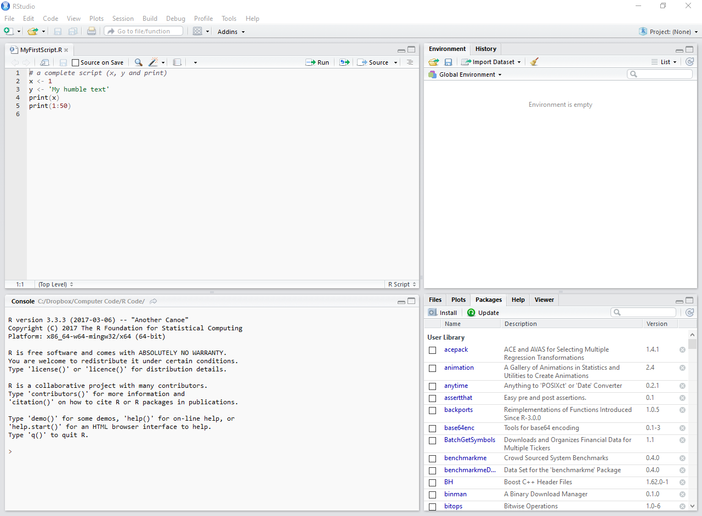
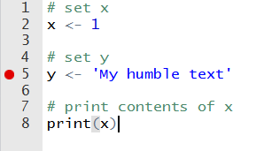
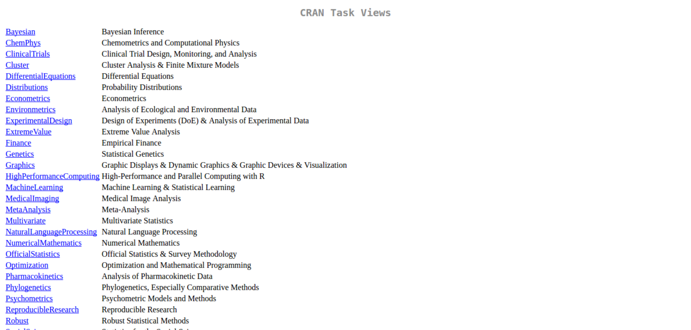
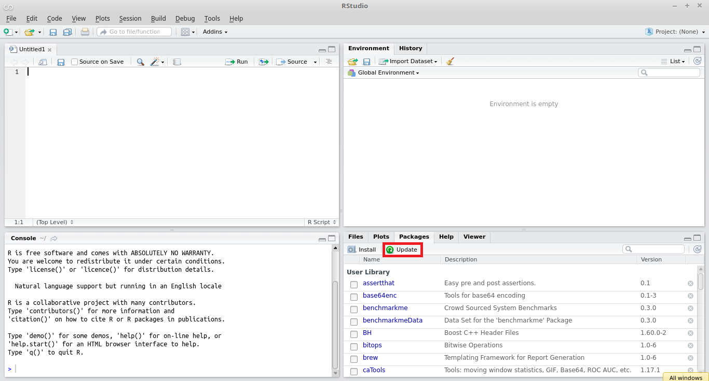

# Processing and Analyzing Financial Data with R
Marcelo S. Perlin (marcelo.perlin@ufrgs.br)  
`r Sys.Date()`  


```r
my.str <- paste(readLines('_Welcome.Rmd'), collapse = '\n')

cat(my.str)
```

# Welcome! {-}


Welcome to the book site of **Processing and Analyzing Financial Data with R**. Here you can find the full online content of the book. The book is also available as an [ebook](PLACEHOLDER) and [print (hardcover)](PLACEHOLDER). If you liked the material and are using the book, please consider purchasing it. As an author, I certainly appreciate the gesture and will take it as a motivating factor for future editions.

This book introduces the reader to the use of **R and RStudio** as a platform for processing and analyzing financial data. The book covers all necessary knowledge for using R, from its installation in your computer to the organization and development of scripts. For every chapter, the book presents practical and replicable examples of R code, providing context and facilitating the learning process.

**Based on the material, the reader will learn how to download financial data from local files or the Internet, represent and process it using native objects in R, and create tables and figures to report the results in a technical document.** The book is organized based on the author's practical experience in scientific research and includes instructions for using the best R packages for each purpose, such as `xtable` and `texreg` for reporting tables, `dplyr` in data processing, and `ggplot2` in creating figures. After presenting the capabilities of R in processing financial data, the last chapter presents three complete and reproducible examples of research in Finance.

This book is recommended for postgraduate researchers and students interested in learning how to use R. **No prior knowledge of programming or finance is required to take advantage of this book.** After finishing, the reader will have enough knowledge to develop their own scripts autonomously, producing academic documents or data analysis for public and private institutions.


<!--chapter:end:index.Rmd-->

# Preface {-}

Since you are reading this book, you are likely a financial analyst looking for alternative and more efficient ways to process your financial data, an undergraduate or graduate student in its first steps regarding scientific research, or an experienced researcher, looking for new tools to use in your work. In all cases, this book is for you. The objective of this work is to introduce the reader to the use of R as a computational tool for data analysis, with a special emphasis on empirical research in finance. With this book, you will learn how to load financial data into R, manipulate the information in a way that makes sense to your problem and build the content of a report with tables and figures. 

The material in this book started as class slides from my work as a teacher and researcher. By watching students learning and using R in the classroom, I frequently observe the positive impact this knowledge has in their careers. They can do complex data tasks with their computer, providing better and more comprehensive analysis to help the decision making process in their organizations. They spend less time doing repetitive and soul-crushing  data chores and more time thinking about their analysis. This book attempts to go beyond the classroom and reach a bigger and more diversified audience.

Another motivation for writing this book is my personal experience using code from other researchers. Usually, the code is not well-organized, lacks clarity, and, possibly, only works in the computer of its author! After being constantly frustrated, I realized the work needed to figure out the code of other researchers would take more time than writing the procedure myself. These cases hurt the development of science, as one of it basic principles is the **reproducibility** of experiments. For the case of a computer intensive field, such as empirical finance, the underlying research code should run without effort in other people's computers. As researchers are expected to be good writers, it should also be expected that their code is in a proper format and readable by other people. Unfortunately, this is not usual.  With this book, I will tackle this problem by presenting a code structure focused on scientific reproducibility, organization, and usability. 

In this book, we will not work on the advanced uses of R. The content will be limited to simple and practical examples of using the software to construct research focused on the area of Finance. One of the challenges of writing this book was defining the boundary between introductory and advanced material. Wherever possible, I gradually dosed the level of complexity. For readers interested in learning advanced features of the program and its inner workings, I suggest the work of @venables2004introduction, @teetor2011r and @wickham2014advanced.

The book includes the following chapters:

- **Chapter 1 - Introduction** -  Introduces the reader to the use of R as a programming platform designed to solve data related problems in finance. In this chapter, we will present the steps for installing the required software and the reasons why you should adopt it.

- **Chapter 2 - Basic Operations** -  Discusses the basic commands in R and the features of RStudio. These are common operations and form the groundwork of using the software. It includes the topics of objects creation, international and local format, using auto-complete features of RStudio and many more. 

- **Chapter 3 - Basic Classes** - Presents the most used classes of objects in R, including numeric types, factors, text and Dates. In this chapter you'll learn how to use the basic classes to represent information about your data problem and the possible manipulations for each type of object.

- **Chapter 4 - Data Structure Classes** - Discusses the use of more advanced objects that structure the basic classes in an efficient way. It includes lists, matrices and dataframes. Most importantly, we will discuss the use of dataframes, a powerful and flexible object that will represent our whole dataset.

- **Chapter 5 - Financial Data and Common Operations** - In this chapter we will discuss the origin and content of the most used types of financial data, including data from financial markets, project assessment and financial statements. Common operations with this data, such as the calculation of returns, are also discussed.

- **Chapter 6 - Importing and Exporting Data** - This chapter presents the most common functions for importing and exporting data. A special emphasis is given to importing financial datasets from the Internet using specialized packages. 

- **Chapter 7 - Programming and Data Analysis with R** - In this chapter we will learn the programming capabilities of R, including the use of functions, loops and conditional statements. A special emphasis is given for using R's functions in the manipulation of  financial datasets. Package `dplyr` is also presented as an alternative and efficient way of processing financial information. 

- **Chapter 8 - Creating and Saving Figures with `ggplot2`** - Here we will learn to use functions from package `ggplot2` to create visualizations of our financial datasets, including the most common cases in finance, time series and statistical plots. 

- **Chapter 9 - Financial Econometrics with R** - Presents the use of six common econometric models for financial research. It includes linear, GLM, panel data, Arima, Garch and markov switching models. For each type of model, we will learn how to simulate, estimate and forecast. Whenever appropriate, we will also learn to use R in the calculation of related statistical tests. 

- **Chapter 10 - Writing Research Scripts** - Discusses the structure of a research script, including stages and folder organization. Three replicable examples of financial research scripts are presented. This includes an analysis of the performance of international stock  indices, a study for the performance of a forecasting algorithm and an analysis of high frequency trade data.  

I'm a fan of open source code. All the code used in the book, including examples separated by chapters, is available on the Internet. I also maintain a personal website with details of my work as a researcher and a _blog_ (_R and Finance_), where I  write about the use of R on specific problems among other things. All web addresses are given below:

\vspace{0.5cm}

Book site: [https://sites.google.com/view/pmfdr/home](https://sites.google.com/view/pmfdr/home)

Personal page: [https://sites.google.com/site/marceloperlin/](https://sites.google.com/site/marceloperlin/)

Blog _R and Finance_: [https://msperlin.github.io/](https://msperlin.github.io/)

\vspace{0.5cm}

A suggestion, before you read the book, go to the [book website](https://sites.google.com/view/pmfdr/home) and look at the related links page. There, you will find all internet addresses highlighted in the text, including the links for the installation of R and RStudio.

I hope you enjoy this book and find it useful. 

Good reading!

Marcelo S. Perlin

<!--chapter:end:00-Preface.Rmd-->

# Introduction

**In the digital era, information is abundant and cheap**. From the ever-changing price of financial contracts to the unstructured data of social media websites, the high volume of information we observe in the workplace creates a strong need for data analysis. A company or organization benefits immensely when it can create a bridge between raw information from its environment and making strategic decisions. Undoubtedly, this is a prolific time for professionals skilled in using the right tools for acquiring, storing, and analysing data. 

In particular, datasets related to Economy and Finance are widely available to the public. International and local institutions, such as central banks, national research agencies, financial exchanges, and many others, provide their data publicly, either by legal obligation or to foment research. Whether you are looking into statistics for a particular country or a company, most information is just a couple of clicks away. By analysing this information efficiently, you'll be able to offer valuable insights to your team. 

Technological advancements were accompanied by a decrease in computational cost. Today, home computers can process massive amounts of data in a short while, making it accessible to anyone. The methods applied to the data have also advanced in complexity. While in the past, a simple spreadsheet can do the job; today, the situation is different. For areas of knowledge with practical applications, such as Economy and Finance, it is expected that a graduate student or a data analyst has learned at least one programming language that allows him to do his work in an efficient manner. Learning how to program is becoming a requisite for the job market.

In this setup, the role of R, a programming language aimed to solve computational problems involving data analysis, shines. In the following sections, we will explain what R is and why you should use it .


## What is R

R is a programming language specially designed to resolve statistical problems and allow the graphical display of data. R is a GNU version of S, a programming language originally created in Bell Laboratories (formerly AT&T, now Lucent Technologies). The base code of R was developed by two academics, **Ross Ihaka** and **Robert Gentleman**, resulting in the programming platform we have today. For anyone curious about the name, the letter R was chosen due to the common first letter of the name of their creators.  \index{R language} \index{S language}

Today, R is almost synonymous to data analysis, with a large user base and defined packages that extend its use. It is likely that researchers from various fields, from Economics to Biology, find in R significant preexisting code that facilitates their analysis. In the business side, large and established companies, such as _Google_ and _Microsoft_, already adopted R as the internal language for data analysis. R is maintained by [**R Foundation**](https://www.r-project.org/foundation/) and the [**R Consortium**](https://www.r-consortium.org/), a collective effort to fund projects for extending the programming language. \index{R foundation} \index{R consortium}


## Why Choose R

Learning a new programming language requires a lot of time and effort. Perhaps you're wondering why you should opt for R and invest time in learning it. Here are the main arguments.

First, **R is a mature, stable platform, continuously supported and intensively used in the industry**. When choosing R, you will have the computational background not only for an academic career in scientific research, but also to work as a data analyst in private organizations. If you are a student, learning R will create more options for your future career. Also, the strong support from the community means it very unlikely the R platform will ever fade away or be substituted for something else. Depending on your career choices, R might be the only programming language you ever need to learn.

**Learning R is easy**. My experience in teaching R allows me to say students, even those with no programming experience, have no problem learning the language and using it to create their own code. The language is intuitive and certain rules and functions can be extended to different cases. For example, function `print` is used to show the contents of an object on the screen. You can use it for any kind of object as it adapts to the class of the object. So, by learning it one time, you'll be able to apply it in many different scenarios. Once you understand how the program works, it is easy to discover new features starting from a previous logic. This generic notation facilitates the learning process.

**The engine of R and the interface of RStudio creates a highly productive environment**. The graphical interface provided by RStudio facilitates the use of R and increases productivity. By combining both, the user has at his disposal many tools that facilitate the use of the platform. \index{RStudio }

**R is compatible with different operating systems and it can interface with different programming languages**. If you need to use a code in other programming language, such as _C++_, _Python_, _Julia_, it is easy to integrate it with R. Therefore, the user is not restricted to a single language and can use features and functions from other platforms. The possibility of using other programming languages within R is part of its functionalities. \index{C++} \index{Python} \index{Julia}

**R is free!** The main software and all its packages are free to use. For most packages, the user's license gives you freedom to use and modify the code freely in your work. This supports the adoption of the R language in a business environment, where obtaining individual and collective licenses of commercial software can cause a high financial cost. Not surprisingly, R is used in a large number of companies.


## What Can You Do With R and RStudio?

R is a fairly complete programming language and any computational problem can be solved based on it. Given the adoption of R for different areas of knowledge, the list is extensive. With finance, I highlight the following possibilities:

* Import, export, process, and store financial data based on local files or the internet;

* Substitute and improve data intensive tasks from spreadsheet like software;

* Develop routines for managing and controlling investment portfolios and executing financial orders;

* Implementation of various possibilities of empirical research through statistical tools, such as econometric models and hypothesis testing;

* Create dynamic _websites_ with the `Shiny` package, allowing anyone in the world to use a financial tool created by you; \index{shiny}

* Create an automated process of developing technical financial reports with package `knitr`; \index{knitr} 

* Write a technical book with `bookdown`; \index{bookdown}

* Write and publish a blog about finance with `blogdown`; \index{bookdown}

Besides the previously highlighted uses, public access to packages developed by users further expands these capabilities. The [CRAN website](https://cran.r-project.org/web/views/Finance.html) offers a _Task Views_ panel for the  topic of Finance. On this page, you can find the main packages available to perform specific operations in Finance. This includes importing financial data from the internet, estimating econometric model, calculation of different risk estimates, among many other possibilities. Reading this page and the knowledge of these packages is essential for those who intend to work in Finance. It is worth noting, however, this list contains only the main items. The complete list of packages related to Finance is much larger than shown in _Task Views_. The link to the CRAN site is available on the [book page](https://sites.google.com/view/pmfdr/home). In this book, we will cover many packages from the task view in finance.


## Installing R and RStudio

Before going further, let's install the required software on your computer. R is installed on your operating system like any other program. The most direct and practical way to install it is to go to [R website](http://www.r-project.org/) and click the _Download_ link in the left side of the page, as shown in Figure \@ref(fig:website-cran-1).

<div class="figure" style="text-align: center">

<p class="caption">(\#fig:website-cran-1)Initial page for downloading R</p>
</div>

The next screen gives you a choice of mirror to download the installation files. The CRAN repository (_R Comprehensive Archive network_) is mirrored in various parts of the world to improve the access speed. You can choose one of the links from the nearest location to you. If undecided, just select the mirror _0-Cloud_, as show in Figure \@ref(fig:website-cran-2).

<div class="figure" style="text-align: center">

<p class="caption">(\#fig:website-cran-2)Choosing the CRAN mirror</p>
</div>

The next step involves selecting your operating system. This is likely to be _Windows_. Due to the greater popularity of this platform, from now on, we will focus on installing R in Windows. The instructions for installing R in other operating systems can be easily found [online](https://www.google.com.br/webhp?sourceid=chrome-instant&ion=1&espv=2&ie=UTF-8#q=installing+r&*). Regardless of the underlying platform, using R is about the same. There are a few exceptions, especially when R interacts with the file system. In the content of the book, special care was taken to choose functions that work the same way in different operating systems. A few  exceptions are highlighted throughout the book. So, even if you are using Mac or Linux, you can take full advantage of the material presented here .

<div class="figure" style="text-align: center">

<p class="caption">(\#fig:website-cran-3)Choosing the operating system</p>
</div>

After clicking the link _Download R for Windows_, as in Figure \@ref(fig:website-cran-3), the next screen will show the following download options: _base_, _contrib_, _old.contrib_ and _RTools_. Among the _download_ options, the first (_base_), should be selected. It contains the basic installation of R in _Windows_. If the user is interested in creating and distributing their own R packages, it is necessary to install _RTools_. For most users, however, this should not be the case, so I suggest ignoring this program. The links to _contrib_ and _old.contrib_ relate to files for the current and old releases of R packages. You should not worry about it for now. We will discuss the use of packages in the next chapter.

<div class="figure" style="text-align: center">

<p class="caption">(\#fig:website-cran-4)Installation options</p>
</div>

After clicking the link _base_, the next screen will show the link to the _download_ of the R installation file (Figure \@ref(fig:website-cran-5)). After downloading the file, open it and follow the steps in the installation screen. At this time, no special configuration is required. I suggest keeping all the default choices and simply hit _accept_ in the displayed dialogue screens. After the installation of R, it is strongly recommended to install RStudio, which will be addressed next .


<div class="figure" style="text-align: center">

<p class="caption">(\#fig:website-cran-5)Downloading R</p>
</div>

The base installation of R includes its own _GUI_ (graphical user interface) that facilitates the use of the program. However, this native interface has several limitations. RStudio is a software that substitutes the original interface and makes the access to R more practical and efficient. One way to understand this relationship is with an analogy with cars. While R is the engine of the programming language, RStudio is the body and instrument panel, which significantly improve the user experience. Besides presenting a more attractive look, RStudio also adds several features that make the life of a programmer easier, allowing the creation of projects and packages, creation of dynamic documents (_Sweave/knitr_), among others. As an example, the book you are reading was written in RStudio with package `bookdown`. \index{RStudio} \index{bookdown}

The installation of RStudio is simpler than that of R. The files are available in [RStudio website](https://www.rstudio.com/), provided in the [book site](https://sites.google.com/view/pmfdr/home). After accessing the page, click _Download RStudio_ and then _Download RStudio Desktop_. After that, just select the installation file relative to the operating system on which you will work. This option is probably _WINDOWS Vista 7/8/10_. Note that, as well as R, RStudio is also available for alternative platforms.

I emphasize that using RStudio is not essential to develop programs in R. Other interface software are available and can be used. However, in my experience, RStudio is the interface that offers the widest range of features for the language and is widely used, which justifies its choice.

## Resources in the Web

The R community is vivid and engaging. There are many authors, such as myself, that constantly release material about R in their blogs and are happy to discuss it. It includes package announcements, posts about data analysis in real life, curiosities, rants and tutorials. [R-Bloggers](https://www.r-bloggers.com/) is a website that aggregates these blogs in a single place, making it easier for anyone to access and participate. I strongly recommend to sign up for the R-Bloggers feed in [RSS](https://feeds.feedburner.com/RBloggers), [Facebook](https://www.facebook.com/rbloggers/?fref=ts) or [Twitter](https://twitter.com/Rbloggers). Not only you'll be informed of what is happening in the R community, but also learn a lot by reading other people code and articles.

Learning and using R can be a social experience. Several conferences and user-groups are available in many countries. You can find the complete list in this [link](https://jumpingrivers.github.io/meetingsR/index.html). I also suggest looking for local groups in Facebook. These may not be registered in the previous link.


## Structure and Organization

This book presents a practical approach to the use of R in finance, accompanied by R code, which will show and illustrate the functionality of the program. To get the most out of this book, I suggest you first seek to understand the code shown, and only then, try using it on your own computer.

Learning to program in a new language is like learning a foreign spoken language: the use in day-to-day problems is imperative to create fluency. All the code and data used in this book is available in the [book webpage](https://sites.google.com/view/pmfdr/home). I suggest you test the code on your computer and _play_ with it, modifying the examples and checking the effect of changes in the outputs. Whenever you have a computational problem, try using R for solving it. You'll stumble and make mistakes at first. But I guarantee that, soon enough, you'll be able to write complex data tasks effortlessly. 

Throughout the book, every demonstration of code will have two parts: the R code and its output. The output is nothing more than the result of the commands in the program screen. All inputs and outputs code will be marked in the text with a special format. See the following example:


```r
# create a list
x <- list('abc', 1:5, 'dec')

# print list
print(x)
```

```
## [[1]]
## [1] "abc"
## 
## [[2]]
## [1] 1 2 3 4 5
## 
## [[3]]
## [1] "dec"
```

For the previous chunk of code, lines `x <- list('abc', 1:5, 'dec')` and `print(x)` are actual commands given to R. The program output is the on-screen presentation of the contents of object `x` with the predecessor symbol `##`. This symbol is used for any code output. Notice also that inline comments are set with the symbol `#`. Anything in the right side of `#` is not evaluated by R. These comments serve as written notes about the code.

Code can also be spatially organized using new lines. This is a common procedure around arguments of functions. The next chunk of code is equivalent to the previous, and will run the exact same way. Notice how we used a new line to vertically align the arguments of function `list`. You'll soon see that, throughout the book, this type of vertical alignment is constantly used.


```r
# create a list
x <- list('abc', 
          1:5, 
		  'dec')

# print list
print(x)
```

```
## [[1]]
## [1] "abc"
## 
## [[2]]
## [1] 1 2 3 4 5
## 
## [[3]]
## [1] "dec"
```

The code also follows a well-defined structure. One decision in writing computer code is how to name objects and how to structure it. It is recommended to follow a clear pattern, so it is easy to maintain over time and be used and understood by others. For this book, a mixture of the author's personal choices with the coding style suggested by Google (link on the [book website](https://sites.google.com/view/pmfdr/home)) was used. The reader, however, may choose the structure he finds more efficient and aesthetically pleasing. Like many things in life, this is a choice. 


<!--chapter:end:01-Introduction.Rmd-->

# Basic Operations in R


Before you start developing your code, you need to understand how to work with R and RStudio. This includes work patterns, language components, basic commands and RStudio shortcuts. Understanding the software and how to take advantage of the platform is essential for the development of data-based research scripts. This is the main chapter for those who are not familiar with R or other programming languages.

In this section, we will go through the initial steps from the point of view of someone who has never worked with R and possibly never had contact with another programming language. Those already familiar with the program will not find novel information here and therefore, I suggest you skip to the next section. It is recommended, however, that you at least check the topics discussed here so that you can confirm your knowledge about the features of the program.


## Working With R

The greatest difficulty a new user experiences when starting to develop routines in R is the format of work. Our interaction with computers has been simplified over the years and we are currently comfortable with the _point&click_ format. That is, if you want to perform some operation on the computer, just point the _mouse_ to the specific location on the screen and click the button that performs the operation. Visual cues and a series of steps in this direction allows the execution of complex tasks. But, be aware that this form of interaction is just one layer above what actually happens on the computer. Behind all  these _clicks_, there is a command being executed. Any common task such as opening a _pdf_ file, a spreadsheet document, directing a _browser_ to a web page has an underlying call to a command. This command was created by the program developer to run within your operating system.

While this visual and motor interaction format has its benefits in facilitating and popularizing the use of computers, it is not flexible and effective when working with computational procedures. By knowing the commands available to the user, it is possible to create a file containing several instructions in sequence and, in the future, simply request that the computer **execute** this file using the recorded procedures. There is no need to do a "scripted" point&click operation. You need to spend some time creating the program but, in the future, it will always execute the recorded procedure in the same way. In the medium and long term, there is a significant gain in productivity between the use of a _script_ (sequence of commands) and a _point&click_ type of interface. Going further, the risk of human error in executing the procedure is almost nil because the commands and their sequence are recorded in the text file and will always be executed in the same way. This is one of the main reasons why programming languages are popular in science. All steps of data based research can be replicated.

In the use of R, the ideal format of work is to merge the use of the mouse with commands. R and RStudio have some functionality with the _mouse_, but their capacity is optimized when we perform operations using code. When a group of commands is performed in a smart way, we have an R script that should preferably produce something important to us at the end of its execution. In Finance, this can be the updated value of an investment, the calculation of the risk of a portfolio, the historical performance of an investment strategy, the result of an academic research, among many other possibilities.

Like other software, R allows us to import data and export files. We can use code to import a dataset stored in a local file (or the web), do an analysis of this data and save the results to later import it into a technical report. In fact, we can use RStudio to write a dynamic report, where code and content are integrated, using _knitr_ and _Sweave_ [@leisch2002sweave]. For example, the book you're reading was written using _knitr_  and the `bookdown` package [@xie2016bookdown]. The book is compiled with the execution of the R codes and their outputs are recorded in the scope of the text. All figures and data tasks in the book can be updated with the execution of a simple command. Needless to say that by using the  capabilities of R and RStudio, you will work smarter and faster. \index{bookdown} \index{knitr}


## Objects in R

**In R, everything is an object, and each type of object has its properties**. For example, the daily market closing prices of a stock can be represented as a numerical vector, where each element is a price recorded at the end of a trading day. Dates and times related to these prices can be represented as text (_string_) or one of the `datetime` classes. Finally, we can represent the price data and the dates together by storing them in a single object of type _dataframe_, which is nothing more than a table with rows and columns. These objects are part of the R ecosystem, and it is through their manipulation that we take full advantage of the software.

While we represent data as objects in R, a special type is a `function`, which stores a pre-established procedure that is available to the user. R has an extremely large number of functions, which enable the user to perform a wide range of operations. For example, the basic commands of R, available in the package `base`, adds up to a total of 1217 functions. Each function has its own name and a programmer can write their own functions. For example, the `mean` function is a procedure that calculates the average values of a vector. If we wanted to calculate the average value of the sequence `1, 2, 3, 4, 5`, simply insert the following command in the _prompt_ (left bottom of RStudio) and press _enter_: \index{base!mean} \index{functions} 


```r
mean(1:5, na.rm = TRUE)
```

```
## [1] 3
```

The _:_ symbol used above creates a sequence starting at 1 and ending at 5 (more details about this operator in a later section). Note that the `mean` function is used with start and end parentheses. These parentheses serve to highlight the entries (_inputs_), that is, the information sent to the function to produce something. Note that each entry is separated by a comma, as in `MyFct(input1, input2, input3, ...)`. We also set option `na.rm = TRUE`. This is a specific directive for the `mean` function to ignore elements of type `NA` (_not available_), if they exist. This specific type of object will also be discussed in a future chapter.

Functions are at the heart of R and we will dedicate a large part of this book to them. You can use the available functions or write your own. You can also publish your functions and let other people use your code. In a later chapter, we will learn how to use functions to do data analysis in an efficient way. 

 
## International and Local Formats

Before beginning to explain the use of R and RStudio, it is important to highlight some rules of formatting numbers, Latin characters and date formats.

* **decimal:** Following  an international notation, the decimal point in R is defined by the period symbol (.), as in `2.5` and not comma, as in `2,5`. In some countries, this might not be the case. This difference can create a lot of confusion and errors at the beginning. Some software, such as Microsoft Excel, does the conversion automatically when the data is imported. This, however, is generally an exception. As a general rule of using R, only use commas to separate the inputs of a function. Under no circumstances should the comma symbol be used as the decimal point separator. Always give priority to the international format because it will be compatible with the vast majority of data. Other researchers may experience some difficulty in understanding your code if you use your local notation for the decimal. \index{decimal}

* **Latin characters:** Due to its international standard, R has problems understanding Latin characters, such as the cedilla and accents. If you can avoid it, do not use these characters in the names of your variables or files. In character objects (text), you can use them without problems as long as the encoding is correctly specified (e.g. UTF-8, Latin1). Given that, it is recommended that the R code be written in the English language. This automatically eliminates the use of Latin characters and facilitates the usability of the code by people outside of your country.  \index{latin characters} \index{UTF-8} \index{Latin1}

* **date format:** Dates in R are formatted according to the `YYYY-MM-DD` pattern, where `YYYY` is the year in four numbers, `MM` is the month and `DD` is the day. An example is 2017-04-29. This may not be the case in your country. When importing local datasets, make sure that the dates are in this format or do a conversion. Again, while you can work with your local format of dates in R, it is best advised to use the international notation. The conversion between one format and another is quite easy and will be presented in a future chapter. \index{dates}

If you want to learn more about your local format in R, use the following command by typing it in the prompt and pressing enter:


```r
Sys.localeconv()
```

```
##     decimal_point     thousands_sep          grouping 
##               "."                ""                "" 
##   int_curr_symbol   currency_symbol mon_decimal_point 
##             "BRL"              "R$"               "," 
## mon_thousands_sep      mon_grouping     positive_sign 
##               "."            "\003"                "" 
##     negative_sign   int_frac_digits       frac_digits 
##               "-"               "2"               "2" 
##     p_cs_precedes    p_sep_by_space     n_cs_precedes 
##               "1"               "1"               "1" 
##    n_sep_by_space       p_sign_posn       n_sign_posn 
##               "1"               "3"               "3"
```

The output of `Sys.localeconv()` shows how R interprets decimal points and the thousands separator, among other things. As you can see from the previous output, this book was compiled using the Brazilian notation for currency but uses the dot point for decimals. As mentioned before, it is good policy to follow international notation, especially for the decimal point. If necessary, you can change your local format to the US/international notation using the following command.


```r
Sys.setlocale("LC_ALL", "English")
```

A note, however, is that you'll need to run this command every time that R starts or incorporate it in the initialization of the software. 	

	
## Types of Files in R

Like any other programming platform, R has a file ecosystem and each type of file has a different purpose. In the vast majority of cases, however, the work will focus mostly on two types: _.R_ and _.RData_ files. Next, I provide a description of various file extensions. The items in the list are ordered by importance. Note that we omit graphic files such as _.png_, _.jpg_, _.gif_ and data storage files (_.csv_, _.xlsx_, ..) among others, as they are not exclusive to R. \index{file types!.R}  \index{file types!.RData} \index{file types!.Rmd}

* **Files with the extension _.R _**: text files containing several instructions for R. These are the files that will contain the sequence of commands that configures the main script and subroutines of the data research. Examples: My-Research.R, My_Functions.R.

* **Files with extension _.RData_**: files that store data in R native format. These files are used to save (write) objects created in different sessions. For example, you can use a _.RData_ file to save a table after processing and cleaning up the raw database. This file can be later loaded for a subsequent analysis. Examples: My_data.RData, Research_Results.RData.

* **Files with extension _.Rmd_, _.md_ and _.Rnw_**: represent files used for editing dynamic documents related to the _Rmarkdown_ and _markdown_  formats. The use of these files allows the creation of documents where text and code output are integrated. This is an advanced topic and will not be covered in this book. For those interested, I suggest reading @baumer2014r and a tutorial at this [link](http://rmarkdown.rstudio.com/index.html). Example: My_Report.Rmd. \index{Rmarkdown} \index{markdown}

* **Files with extension _.Rproj_**: contain files for editing projects in RStudio, such as a new package, a _shiny_ application or a book. This is also an advanced topic and will not be dealt with here. While you can use the functionalities of RStudio projects to write R scripts, it is not a necessity. For those interested in learning more about this functionality, I suggest the [RStudio manual](https://support.rstudio.com/hc/en-us/articles/200526207-Using-Projects). Example: MyProject.Rproj.  \index{RStudio projects}


## Explaining the RStudio Screen

After installing the two programs, R and RStudio, open RStudio by double clicking its icon. It should be noted that R also has an interface program and this often causes confusion. You should find the correct shortcut for RStudio by going through your software folders. In Windows, you can search for RStudio using the _Start_ button.  \index{RStudio}
 
After opening RStudio, the resulting window should look like Figure \@ref(fig:RStudio1).

<div class="figure" style="text-align: center">

<p class="caption">(\#fig:RStudio1)The RStudio screen</p>
</div>

Note that RStudio automatically detected the installation of R and initialized your screen on the left side.

If you do not see something like this on the screen of RStudio:

```
R version 3.3.3 (2017-03-06) -- "Another Canoe"
Copyright (C) 2017 The R Foundation for Statistical Computing
Platform: x86_64-w64-mingw32/x64 (64-bit)

R is free software and comes with ABSOLUTELY NO WARRANTY.
You are welcome to redistribute it under certain conditions.
Type 'license()' or 'licence()' for distribution details.

R is a collaborative project with many contributors.
Type 'contributors()' for more information and
'citation()' on how to cite R or R packages in publications.

Type 'demo()' for some demos, 'help()' for on-line help, or
'help.start()' for an HTML browser interface to help.
Type 'q()' to quit R.
```

then R was not installed correctly. Repeat the installation steps in the previous chapter and confirm the startup message on the lower left side of RStudio.

As a first exercise, click _file_, _New File_, and _R Script_. A text editor should appear on the left side of the screen. It is there that we will enter our commands, which are executed from top to bottom, in the same direction that we normally read text. A side note, all _.R_ files created in RStudio are just text files and can be edited in other editors as well. It is not uncommon for experienced programmers to use a specific software to write code and another to run it. The resulting screen should look like the following:

<div class="figure" style="text-align: center">

<p class="caption">(\#fig:RStudio2)Explaining the RStudio screen</p>
</div>

The main items/panels of the RStudio screen in Figure \@ref(fig:RStudio2) are:

* **Script Editor:** located on the left side and above the screen. This panel is used to write scripts and functions; \index{script editor}

* **R prompt:** located on the left side and below the script editor. It displays the _prompt_  of R, which can also be used to give commands to R. The main function of the prompt is to test code and display the results of the commands entered in the script editor; \index{prompt}

* **Environment:** located on the top-right of the screen.  Shows all objects, including variables and functions currently available to the user. Also note a _History_ panel, which shows the history of the commands previously executed by the user; \index{environment}

* **Panel Packages:** shows the packages installed and loaded by R. Here you have four tabs: _Files_, to load and view system files; _Plots_, to view pictures; _Help_ to access the help system and _Viewer_ to display dynamic and interactive results, such as a web page. \index{RStudio panels}

As an introductory exercise, let's initialize two objects in R. Inside the prompt (lower left side), insert the following commands and press _enter_ at the end of each. The `<-` symbol is nothing more than the result of joining `<` (less than) with the `-` (minus sign). The `'` symbol represents a single quotation mark and, in the computer keyboard, it is found under the escape (_esc_) key.


```r
# set x
x <- 1

# set y
y <- 'My humble text'
```

If done correctly, notice that two objects appeared in the _environment_ panel, one called `x` with a value of 1, and another called `y` with the text content `"My humble text"`. Notice how we used specific symbols to define objects `x ` and `y`. The use of double quotes (`" "`) or single quotes (`' '`) defines objects of the class `character`. Numbers are defined by the value itself. As will be discussed later, each object in R has a class and each class has a different behaviour. After sending the previous commands to R, the _history tab_ has been updated.

Now, let's show the values of `x` on the screen. To do this, type the following command:


```r
# print contents of x
print(x)
```

```
## [1] 1
```

The `print` function is one of the main functions for displaying values in the _prompt_ of R. The text displayed as `[1]` indicates the index of the first line number. To verify this, enter the following command, which will show a lengthy sequence of numbers on the screen: \index{base!print}


```r
# print a sequence
print(50:100)
```

```
##  [1]  50  51  52  53  54  55  56  57  58  59  60  61  62  63
## [15]  64  65  66  67  68  69  70  71  72  73  74  75  76  77
## [29]  78  79  80  81  82  83  84  85  86  87  88  89  90  91
## [43]  92  93  94  95  96  97  98  99 100
```

In this case, we use the `:` symbol in `50:100` to create a sequence starting at 50 and ending at 100. Note that on the left side of each line, we have the values 1, 15, and 29. These represent the index of the first element presented in the line. For example, the fifteenth element of `50:100` is 64.


## Running Scripts from RStudio

Now, let's combine all the previously typed codes into a single file by copying and pasting all commands into the editor's screen (upper left side). The result looks like Figure \@ref(fig:example-script).

<div class="figure" style="text-align: center">

<p class="caption">(\#fig:example-script)Example of a R script</p>
</div>

After pasting all the commands in the editor, save the _.R_ file to a personal folder where you have read and write permissions. One possibility is to save it in the `My Documents` folder with a name like `'MyFirstRScript.R'`. This saved file, which at the moment does nothing special, records the steps of a simple algorithm that creates several objects and shows their content. In the future, this file can take an expressive size by containing all stages of the data analysis such as importing data, cleaning it, performing the data analysis and exporting tables and figures.

In RStudio, there are some predefined and time-saving shortcuts for running code from the editor. To execute an entire script, simply press `control + shift + s`. This is the _source_ command.  With RStudio open, I suggest testing this key combination and checking how the code saved in a _.R_ file is executed. The output of the script is shown in the prompt of R. The result in RStudio should look like Figure \@ref(fig:example-script-source). \index{source}

<div class="figure" style="text-align: center">

<p class="caption">(\#fig:example-script-source)Example of a R script after execution</p>
</div>

Another very useful command is code execution by the lines. In this case, the whole file is not executed, but only the line where the cursor is located. For that, just press `control + enter`. This shortcut is very useful in developing scripts because it allows each line of the code to be tested before running the entire program. As an example of usage, point the cursor to the `print(x)` line and press `control + enter`. As you will notice, only the line `print(x)` was executed. Therefore, before running the whole script, you can test it line by line and check for possible errors.

Next, I highlight these and other RStudio shortcuts, which are also very useful.

* **control + shift + s**: executes (source) the current RStudio file;
* **control + shift + enter**: executes the current file with echo, showing the commands on the prompt;
* **control + enter**: executes the selected line, showing on-screen commands;
* **control + shift + b**: executes the codes from the beginning of the file to the current line where the cursor is;
* **control + shift + e**: executes the codes of the lines where the cursor is until the end of the file.

My suggestion is to use these shortcuts from day one. They greatly facilitate the use of the program. For those who like to use the _mouse_, an alternate way to execute code is to click the _source_ button in the upper-right corner of the text editor. If you want to set your own shortcuts in RStudio, go to option, "Tools" and "Modify Keyboard Shortcuts". One suggestion here is to set the _source_ command to F5, which is used by several other software as an "execute" shortcut.

If you want to run code in a _.R_ file within another .R file, you can use the `source` command. For example, imagine that you have a main script with your data analysis and another script that performs some support operation such as importing data to R. These operations have been dismembered as a way of organizing the code. \index{base!source}

To run the support _script_, just call it with function `source` in the main script, as in the following code:


```r
# execute import script
source('import-data.R')
```

In this case, all code in `import-data.R` will be executed. This is equivalent to manually opening file `import-data.R` and hitting _control + shift + s_.


## Testing and Debugging Code

The development of code follows a cycle. At first, you will write a command line on a script, try it using _control + enter_ and check the output. A new line of code is written once the previous line worked as expected. A moving cycle is clear, writing code is followed by line execution, followed by result checking, modify and repeat if necessary. This is a normal process. You need to make sure that every line of code is correctly specified before moving to the next one.

When you are trying to find an error in a preexisting script, R offers some tools for controlling and assessing its execution. This is specially useful when you have a long and complicated script. The simplest and easiest tool that R and RStudio offers is code breakpoint. In RStudio, you can click in the left side of the script editor and a red circle will appear, as in Figure \@ref(fig:example-debug).


<div class="figure" style="text-align: center">

<p class="caption">(\#fig:example-debug)Example of breakpoint in an R script</p>
</div>

This red circle indicate a code breakpoint that will force the code to stop at that line. You can use it to test existing code and check its objects at a certain part of the execution. When the execution hits the breakpoint, the prompt will change to `Browse[1]>` and you'll be able to try new code of verify the content of the objects. From the Console, you have the option to continue the execution to the next breakpoint or stop it. The same result can be achieved using function `browser`. Have a look:


```r
# set x
x <- 1

# set y
browser()
y <- 'My humble text'

# print contents of x
print(x)
```

The practical result is the same as using RStudio's red circle, but it gives you more control for the case of several commands in the same line.


## Creating Simple Objects

One of the most basic and most used commands in R is the creation of objects. As shown in  previous sections, you can define an object using the `<-` command, which is verbally translated to _assign_. For example, consider the following code: \index{assign} 


```r
# set x
x <- 123

# set x, y and z in one line
my.x <- 1 ; my.x <- 2; my.z <- 3
```

We can read this code as _the value 123 is assigned to x_. The direction of the arrow defines where the value is stored. For example, using `123 -> x` also works, although this is not recommended as the code becomes less readable. Also notice that you can create objects within the same line by separating the commands using a semi-colon.

The use of an arrow symbol `<-` for object definition is specific to R. The reason for this choice was that, at the time of conception of the _S_ language, keyboards with a key that directly defined the arrow symbol were available and used. This means that the programmer only had to hit one key in the keyboard in order to set the arrow symbol. Modern keyboards, however, do not have this format any more. If you find it troublesome to use this symbol, you can use shortcuts as well. In _Windows_, the shortcut for the the symbol `<-` is `alt` plus `-`.

You can also use the `=` symbol to define objects such as in `x = 123`, but the use of `=` with this specific purpose is not recommended. The symbol of equality has a special use within the definition of function arguments. This case will be better explained and demonstrated in future section.

The name of the object is important in R. With the exception of very specific cases, the user can name objects as he likes. This freedom, however, can be a problem. It is desirable to always give short names that make sense to the content of the script and which are simple to understand. This facilitates the understanding of the code by other users and is part of the suggested set of rules for structuring code. Note that all objects created in this book have nomenclature in English and specific formatting, where the white space between nouns are replaced by a dot, as in `my.x <- 1 ` and `name.of.file <- 'my_file.csv'`.

R executes the code looking for objects available in the environment, including functions. Be aware that R is case sensitive, that is, object `m` is different than `M`. If we try to access an object that does not exist, R will return an error message and stop the execution. Have a look:


```r
print(z)
```

```
## Error in print(z): object 'z' not found
```

The error occurred because object `z` does not exist in the current environment. If we create a variable `z` as `z <- 321` and repeat the command `print(z)`, we will not have the same error message.


## Creating Vectors

In the previous examples, we have created simple objects such as `x <- 1` and `x <- 'abc'`. While this is sufficient to demonstrate the basic commands in R, in practice, such commands are very limited. A real problem of data analysis will certainly have a greater volume of information.

One of the most used procedures in R is the creation of atomic vectors. These are objects that can have several elements. All elements of an atomic vector must have the same class, which justifies its _atomic_ property. An example would be the representation of a series of daily stock prices as an atomic vector of the class `numeric`. Once you have a vector, you can manipulate it anyway you want.

Atomic vectors are created in R using the `c` command, which comes from the verb _combine_. For example, if we wanted to combine the values 1, 2 and 3 in one object, we could do it with the following command: \index{base!c} 


```r
# create numeric atomic vector
x <- c(1,2,3)

# print it
print(x)
```

```
## [1] 1 2 3
```

This command works the same way for any other class of object, such as _character_:


```r
# create character atomic vector
y <- c('text 1', 'text 2', 'text 3', 'text 4')

# print it
print(y)
```

```
## [1] "text 1" "text 2" "text 3" "text 4"
```

The only restriction on the use of the `c` command is that all elements must have the same class. If we insert data from different classes in a call to `c()`, R will try to mutate all elements into the same class following its own logic. If the conversion of all elements to a single class is not possible, an error message is returned. Note the following example, where numeric values are set in the first and second element of `x` and a character in the last element. 


```r
# a mixed vector
x <- c(1, 2, '3')

# print result of forced conversion
print(x)
```

```
## [1] "1" "2" "3"
```

The values of `x` are all of type `character`. The use of `class` command confirms this result:


```r
# print class of x
class(x)
```

```
## [1] "character"
```


## Knowing Your Environment

After using various commands, further development of the script requires you to understand what objects are available and what is their content. You can find this information simply by looking at the upper right screen of RStudio. However, there is a command that shows the same information in the prompt. In order to know what objects are currently available in R's memory, you can use command `ls`. Note the following example: \index{base!ls}


```r
# set some objects
x <- 1
y <- 2
z <- 3

# print all objects in the environment
print(ls())
```


```
## [1] "x" "y" "z"
```

The objects `x`, `y` and `z` were created and are available in the current working environment. If we had other objects, they would also appear in the output to `ls`. Notice that object returned from `ls` is a `character` vector. 

To display the content of each object, just enter the names of objects and press `enter` in the _prompt_:


```r
# print objects by their name
x
```

```
## [1] 1
```

```r
y
```

```
## [1] 2
```

```r
z
```

```
## [1] 3
```

Typing the object name on the screen has the same effect as using the `print` command. In fact, when executing the sole name of a variable in the prompt or script, R internally passes the object to the `print` function. 

In R, all objects belong to a class. As previously mentioned, to find the class of an object, simply use the `class` function. In the following example, `x` is an object of the class `numeric`, `y` is a text (`character`) object and `my.fct` is a function object. \index{base!class}


```r
# set objects
x <- 1
y <- 'a'
my.fct <- function(){}

# print their classes
print(class(x))
```

```
## [1] "numeric"
```

```r
print(class(y))
```

```
## [1] "character"
```

```r
print(class(my.fct))
```

```
## [1] "function"
```

Another way to learn more about an object is to check their textual representation. Every object in R has a textual representation and we can find it with function `str`: \index{base!str}


```r
# print the textual representation of a vector
print(str(1:10))
```

```
##  int [1:10] 1 2 3 4 5 6 7 8 9 10
## NULL
```

This function is particularly useful when trying to understand the details of a more complex object, such as a `dataframe`. We will learn more about using function `str` for learning the contents of a `dataframe` in chapter \@ref(importing).


## Displaying and Formatting Output

So far, we saw that you can show the value of an R object on the screen in two ways. You can either enter its name in the prompt or use the `print` function. Explaining it further, the `print` function focuses on the presentation of objects and can be customized for any type. For example, if we had an object of a class called `MyTable` to represent a specific type of table, we could create a function called ` print.MyTable` that would show a table on the screen with a special format for the rows and column names. Function `print`, therefore, is oriented towards presenting objects and the user can customize it for different classes. The `base` package, which is automatically initialized with R, contains several `print` function for various kinds of objects.

However, there are other specific functions to display text in the prompt. The main one is `cat` (_concatenate and print_). This function takes a text as input, processes it for specific symbols and displays the result on the screen. Function `cat` is more powerful and customizable than `print`. \index{base!cat}

For example, if we wanted to show the text, `The value of x is equal to 2` on screen using a numerical object, we could do it as follows:


```r
# set x
x <- 2

# print customized message
cat('The value of x is ', x)
```

```
## The value of x is  2
```

You can also customize the screen output using specific commands. For example, if we wanted to break a line in the screen output, we could do it through the use of the reserved character `\n`:


```r
# set text with break line
my.text <- ' First Line,\n Second line'

# print it
cat(my.text)
```

```
##  First Line,
##  Second line
```

Note that the use of `print` would not result in the same effect as this command displays the text as it is, without processing it for specific symbols:


```r
print(my.text)
```

```
## [1] " First Line,\n Second line"
```

Another example in the use of specific commands for text is to add a _tab_ space with the symbol `\t`. See an example next:


```r
# set text with tab
my.text <- 'A->\t<-B'

# concatenate and print it!
cat(my.text)
```

```
## A->	<-B
```

Weve only scratched the surface on the possible ways to manipulate text output.  Other ways to manipulate text output based on specific symbols can be found in the [official R manual](https://cran.r-project.org/doc/manuals/R-lang.html#Literal-constants ), available on the book website.


### Customizing the Output

Another way to customize text output is using specific functions to manipulate objects of the class `character`. For that, there are two very useful functions: `paste` and `format`. \index{base!paste}  \index{base!format}

Function `paste` _glues_ a series of objects together. It is a very useful function, and will be used intensely for the rest of the examples in this book. Consider the following example:


```r
# set some text objects
my.text.1 <- 'I am a text'
my.text.2 <- 'very beautiful'
my.text.3 <- 'and informative.'

# paste all objects together and print
cat(paste(my.text.1, my.text.2, my.text.3))
```

```
## I am a text very beautiful and informative.
```

The previous result is not far from what we did in the example with the `print` function. Note, however, that the `paste` function adds a space between each text. If we did not want this space, we could use function `paste0` as in:


```r
# example of paste0
cat(paste0(my.text.1, my.text.2, my.text.3))
```

```
## I am a textvery beautifuland informative.
```

Another very useful possibility with the `paste` function is to insert a text or symbol between the junction of texts. For example, if we wanted to add a comma (`,`) between each item to be pasted, we could do this by using the input option `sep` as follows:


```r
# example using the argument sep
cat(paste(my.text.1, my.text.2, my.text.3, sep = ', ')) 
```

```
## I am a text, very beautiful, and informative.
```

If we had an atomic vector with all elements to be glued in an single object, we could achieve the same result using the `collapse` argument. See an example next.


```r
# set character object 
my.text <-c('I am a text', 'very beautiful', 'and informative.')

# example of using the collapse argument in paste
cat(paste(my.text, collapse = ', ')) 
```

```
## I am a text, very beautiful, and informative.
```

Going forward, command `format` is used to format numbers and dates. It is especially useful when we create tables and we want to present the numbers in a visually appealing way. By definition, R presents a set number of digits after the decimal point: \index{base!format}


```r
# example of decimal points in R
cat(1/3)
```

```
## 0.3333333
```

If we wanted only two digits on the screen, we could use the following code:


```r
# example of using format on numerical objects
cat(format(1/3, digits=2))
```

```
## 0.33
```

Likewise, if we wanted to use a scientific format in the display, we could do the following:


```r
# example of using scientific format
cat(format(1/3, scientific=TRUE))
```

```
## 3.333333e-01
```

Function `format` has many more options. If you need your numbers to come out in a specific way, have a look at the help manual for this function. It is also a generic function and can be used for many types of objects.


## Finding the Size of Objects

In the practice of programming with R, it is very important to know the size of the objects being used. Here, size means the number of individual elements. This information serves not only to assist the programmer in checking possible code errors, but also to know the length of iteration procedures such as _loops_, which will be treated in a later chapter of this book. 

In R, the size of an object can be checked with the use of four main functions: `length`, `nrow`, `ncol` and `dim`. \index{base!length} \index{base!nrow} \index{base!ncol} \index{base!dim}

Function `length` is intended for objects with a single dimension, such as atomic vectors:


```r
# create atomic vector
x <- c(2,3,3,4,2,1)

# get length of x
n <- length(x)

# display message
cat('The size of x is ', n)
```

```
## The size of x is  6
```

For objects with more than one dimension, such as matrices, use functions `nrow`, `ncol` and `dim` (dimension) to find the number of rows (first dimension) and the number of columns (second dimension). See the difference in usage below.


```r
# create a matrix
M <- matrix(1:20, nrow = 4, ncol = 5)

# print matrix
print(M)
```

```
##      [,1] [,2] [,3] [,4] [,5]
## [1,]    1    5    9   13   17
## [2,]    2    6   10   14   18
## [3,]    3    7   11   15   19
## [4,]    4    8   12   16   20
```

```r
# calculate size in different ways
my.nrow <- nrow(M)
my.ncol <- ncol(M)
my.length <- length(M)

# display message 
cat('The number of lines in M is ', my.nrow)
```

```
## The number of lines in M is  4
```

```r
cat('The number of columns in M is ', my.ncol)
```

```
## The number of columns in M is  5
```

```r
cat('The number of elements in M is ', my.length)
```

```
## The number of elements in M is  20
```

The `dim` function shows the dimension of the object, resulting in a numeric vector as output. This function should be used when the object has more than two dimensions. In practice, however, such cases are rare. An example is given next:


```r
# get dimension of M
my.dim <- dim(M)

# print it
print(my.dim)
```

```
## [1] 4 5
```

In the case of objects with more than two dimensions, we can use the `array` function  to create the object and `dim` to find its size. Have a look in the next example:


```r
# create an array with three dimensions
my.array <- array(1:9, dim = c(3,3,3))

# print it
print(my.array)
```

```
## , , 1
## 
##      [,1] [,2] [,3]
## [1,]    1    4    7
## [2,]    2    5    8
## [3,]    3    6    9
## 
## , , 2
## 
##      [,1] [,2] [,3]
## [1,]    1    4    7
## [2,]    2    5    8
## [3,]    3    6    9
## 
## , , 3
## 
##      [,1] [,2] [,3]
## [1,]    1    4    7
## [2,]    2    5    8
## [3,]    3    6    9
```

```r
# display its dimensions
print(dim(my.array))
```

```
## [1] 3 3 3
```

An important note here is that the use of the functions, `length`, `nrow`, `dim` and `ncol` are not intended to discover the number of letters in a text. This is a common mistake. For example, if we had a `character` type of object and we use the `length` function, the result would be the following:


```r
# set text object
my.char <- 'abcde'

# print result of length
print(length(my.char))
```

```
## [1] 1
```

This occurred because the `length` function returns the number of elements in an object. In this case, `my.char` has only one element. To find out the number of characters in the object, we use the `nchar` function as follows: \index{base!nchar}


```r
# find the number of characters in an character object
print(nchar(my.char))
```

```
## [1] 5
```


## Selecting the Elements of an Atomic Vector

After creating an atomic vector of a class, it is possible that the user is interested in only one or more elements of it. For example, if we were updating the value of an investment portfolio, our interest in a vector containing stock prices is only for the latest price. All other prices were not relevant to our analysis and therefore could be ignored.

The selection of _pieces_ of an atomic vector is called indexing and it is accomplished with the use of square brackets (`[ ]`). Consider the following example:


```r
# set x
my.x <- c(1, 5, 4, 3, 2, 7, 3.5, 4.3)
```

If we wanted only the third element of `my.x`, we use the bracket operator as follows:


```r
# get third element of x
elem.x <- my.x[3]

# print it
print(elem.x)
```

```
## [1] 4
```

The procedure of indexing also works with vectors. If we are only interested in the last and penultimate values of `my.x`, we use the following code:


```r
# get last and penultimate value of my.x
piece.x.1 <- my.x[ (length(my.x)-1):length(my.x) ]

# print it
print(piece.x.1)
```

```
## [1] 3.5 4.3
```

A cautionary note. **A unique property of the R language is that if a non existing element is accessed, the program returns the value `NA` (_not available_)**. See the next example code, where we attempt to obtain the fourth value of a vector with only three components.


```r
# set object
my.vec <- c(1,2,3)

# print non-existing fourth element
print(my.vec[4])
```

```
## [1] NA
```

It is important to know this behaviour because the lack of treatment of these errors can lead to problems that are difficult to identify in more complex code. In other programming languages, attempting to access non-existing elements generally returns an error and cancels the execution of the rest of the code. In the case of R, given that access to non-existent elements does not generate an error or _warning_ message, it is possible that this will create a problem in other parts of the script as `NA` objects are contagious. That is, anything that interacts with `NA` will also become `NA`. The user should pay attention every time that `NA` values are found unexpectedly. An inspection in the length and indexation of vectors may be required.

The use of indices is very useful when you are looking for items of a vector that satisfy some condition. For example, if we wanted to find out all values in `my.x` that are greater than 3, we could use the following command:


```r
# find all values in my.x that are greater than 3
piece.x.2 <- my.x[my.x>3]

# print it
print(piece.x.2) 
```

```
## [1] 5.0 4.0 7.0 3.5 4.3
```

It is also possible to index elements by more than one condition using the logical operators `&` (_is_) and `|` (_or_). For example, if we wanted the values of `my.x` greater than 2 **and** lower than 4, we could use the following command: \index{logical operators}


```r
# find all values of my.x that are greater than 2 and lower then 4
piece.x.3 <- my.x[ (my.x>2) & (my.x<4) ]
print(piece.x.3)
```

```
## [1] 3.0 3.5
```

Likewise, if we wanted all items that are lower than 3 **or** greater than 6, we use:


```r
# find all values of my.x that are lower than 3 or higher than 6
piece.x.4 <- my.x[ (my.x<3)|(my.x>6) ]

# print it
print(piece.x.4)
```

```
## [1] 1 2 7
```

Moreover, logic indexing also works with the interaction of different objects. That is, we can use a logical condition in one object to select items from another:


```r
# set my.x and my.y
my.x <- c(1,4,6,8,12)
my.y <- c(-2,-3,4,10,14)

# find all elements of my.x where my.y is higher than 0
my.piece.x <- my.x[ my.y > 0 ]

# print it
print(my.piece.x)
```

```
## [1]  6  8 12
```

Looking more closely at the indexing process, it is worth noting that, when we use a data indexing condition, we are in fact creating a variable of the `logical` type. This object takes only two values: `TRUE` and `FALSE`. Have a look in the code presented next, where we create a `logical` object, print it and present its class.


```r
# create a logical object
my.logical <- my.y > 0

# print it 
print(my.logical) 
```

```
## [1] FALSE FALSE  TRUE  TRUE  TRUE
```

```r
# find its class
class(my.logical)
```

```
## [1] "logical"
```


## Removing Objects from the Memory

After creating several variables, the R environment can become full of content thats already been used and is dispensable. In this case, it is desirable to clear the memory to erase objects that are no longer needed. Generally, this is accomplished at the beginning of a script, so that every time the script runs, the memory will be cleared before any calculation. In addition to cleaning the computer's memory, it also helps to avoid possible errors in the code. In most cases, cleaning the working environment should be performed only once at the beginning of the script.

For example, given an object `x`, we can delete it from memory with the command `rm`, as shown next: \index{base!rm}


```r
# set x
x <- 1

# print all available objects
ls()
```

```
##  [1] "elem.x"       "M"            "my.array"    
##  [4] "my.char"      "my.dim"       "my.engine"   
##  [7] "my.fct"       "my.length"    "my.logical"  
## [10] "my.ncol"      "my.nrow"      "my.out.width"
## [13] "my.piece.x"   "my.str"       "my.text"     
## [16] "my.text.1"    "my.text.2"    "my.text.3"   
## [19] "my.vec"       "my.x"         "my.y"        
## [22] "my.z"         "n"            "piece.x.1"   
## [25] "piece.x.2"    "piece.x.3"    "piece.x.4"   
## [28] "stay.quiet"   "x"            "y"           
## [31] "z"
```

```r
# remove x
rm('x')

# print again all available objects
ls()
```

```
##  [1] "elem.x"       "M"            "my.array"    
##  [4] "my.char"      "my.dim"       "my.engine"   
##  [7] "my.fct"       "my.length"    "my.logical"  
## [10] "my.ncol"      "my.nrow"      "my.out.width"
## [13] "my.piece.x"   "my.str"       "my.text"     
## [16] "my.text.1"    "my.text.2"    "my.text.3"   
## [19] "my.vec"       "my.x"         "my.y"        
## [22] "my.z"         "n"            "piece.x.1"   
## [25] "piece.x.2"    "piece.x.3"    "piece.x.4"   
## [28] "stay.quiet"   "y"            "z"
```

Note that after executing the command `rm('x')`, the value of `x` is no longer available in the output of `ls()`. In practical situations, however, it is desirable to clean up all the memory used by all objects created in R. We can achieve this goal with the following code:


```r
rm(list=ls())
```

The term `list` in `rm(list=ls())` is a function argument of `rm` that defines which objects will be deleted. The `ls()` command shows all the currently available objects. Therefore, by chaining together both commands, we erase all current objects available in the environment. As mentioned before, it is good programming policy to always start the script by clearing the memory. However, you should only wipe out all of R's memory if you have already saved the results of interest or if you can replicate them.


## Displaying and Setting the Working Directory

Like other programming platforms, **R always works in a directory**. If no directory is set, a default value is used when R starts up. It is based on the current directory that R searches for files to load data or other R scripts. It is in this directory that R saves any output we want if we do not explicitly define an address on the computer. This output can be a graphic file, text or a spreadsheet like file. A good programming policy is to change the working directory to the same place where the _script_ is located. In chapter \@ref(research-scripts) we discuss the topic of file and folder organization.

To show the current working directory, use function `getwd`: \index{base!getwd}


```r
# get current dir
my.dir <- getwd()

# display it
print(my.dir)
```

```
## [1] "C:/Dropbox/My Books/pmfdR (en)/Book Content"
```

The result of the previous code shows the folder in which this book was written and compiled. As you can see, the book files are saved in a subfolder of my Dropbox directory. From the path, you should also realize that I'm working in a Windows OS. The root directory `C:/` gives that information away.

The change of working directory is performed with the `setwd` command. For example, if we wanted to change our working directory to _C:/My Research/_, simply type in the _prompt_: \index{base!setwd}


```r
# set where to change directory
my.d <- 'C:/My Research/'

# change it
setwd(my.d)
```

As for simple cases such as the above, remembering the directory name is easy. In practical cases, however, the working directory can be in a deeper directory of the file system. In this situation, an efficient strategy to locate the path is to use a file explorer, like Windows  _explorer_. To do so, open the _explorer_ application and navigate to the location where you want to work with your _script_. Place the cursor in the address bar and select the whole path. Press _control + c_ to copy the address to the clipboard. Go back to your code and paste it in. **An important step here: Windows uses the backslash to set addresses on the computer, while the R uses the forward slash**. If you try to use  backslashes, an error is displayed on the screen. See the following example.


```r
# set directory (WRONG WAY)
my.d <- 'C:\My Research\'
```


```r
cat("##Error: '\\M' is an unrecognized escape in character string")
```

This message means that R was not able to understand the use of backslashes. This is a reserved symbol for macros and should not be used anywhere in a code. Therefore, after copying the address, modify all backslashes to forward slashes, as in the following code:


```r
# set directory (CORRECT WAY)
my.d <- 'C:/My Research/'

# change dir
setwd(my.d)
```

You can also use double backslashes `\\` but this is not recommended as it is not compatible with other operating systems.

Another important information here is that you can also use relative paths. For example, if you are working in a folder that contains a subdirectory called `Data`, you can enter this subfolder with the code:


```r
# change to subfolder
setwd('Data')
```

Another possibility is to go to a previous level of directory using `..`, as in:


```r
# change to previous level
setwd('..')
```

So, if you are working in the directory `C:/My Research/` and execute the command `setwd('..')`, the current folder becomes `C:/`, which is one level above `C:/My Research/`.

Another, more modern, way of setting the directory is to use RStudio API functions. This is a set of functions that only work inside RStudio and provides information about current file, project and many more. To find out the path of the current R script being edited in RStudio and set the working directory to there, you can write:


```r
my.path <- dirname(rstudioapi::getActiveDocumentContext()$path)
setwd(my.path)
```

This way, the script will change the directory to its own location, no matter where you copy it. Be aware, however, that this trick only works in RStudio script editor and within a saved file. It will not work from the prompt.


## Cancelling Code Execution

Whenever R is running some code, a visual cue in the shape of a small red circle in the right corner of the _prompt_ will appear. If you read it, the text shows the _stop_ word. This button is not only an indicator for running code but also a shortcut for cancelling its execution. Another way to cancel an execution is to point the mouse to the _prompt_ and press the _escape_ (_esc_) button from the keyboard.

To try it out, run the next chunk of code in RStudio and cancel its execution using _esc_.


```r
for (i in 1:100) {
  cat('\nRunning code (please make it stop by hitting esc!)')
  Sys.sleep(1)
}
```

In the previous code, we used a `for` loop to display the message `'\nRunning code (please make it stop by hitting esc!)'` every second. For now, do not worry about the code and functions used in the example. We will discuss the use of loops chapter \@ref(programming). 


## Code Comments

In R, comments are set using the hash tag symbol `#`. Anything after this symbol will not be processed by R. This gives you freedom to write whatever you want within the script. An example:


```r
# this is a comment (R will not parse it)
# this is another comment (R will not parse it)

x <- 'abc' # this is an inline comment 
```

Comments are a way to communicate any important information that cannot be directly inferred from the code. In general, you should avoid using comments that are too obvious or too generic. For example:


```r
# read csv file
df <- read.csv('MyDataFile.csv')
```

As you can see, it is quite obvious from line `df <- read.csv('MyDataFile.csv)` that the code is reading a .csv file. The name of the function already states that. So, the comment was not a good one as it did not add any new information to the user. A better approach at commenting would be to set the author, description of script and better explain the origin and last update of the data file. Have a look:


```r
# Script for analysing a dataset
# Author: Mr data analyst (dontspamme@emailprovider.com)
# Last script update: 2017-03-10
#
# File downloaded from www.sitewithdatafiles.com/data-files/
# The description of the data goes here
# Last file update: 2017-03-10
df <- read.csv('MyDataFile.csv')
```

So, by reading the comments, the user will know the purpose of the script, who wrote it and the date of the last edit. It also includes the origin of the data file and the date of the latest update. If the user wants to update the data, all he has to do is to go to the referred website and download the new file. If the datafile is updated, a new date should be placed in "Last file update".

Another use of comments is to set sections in the code, such as in:


```r
# Script for analysing a dataset
# Author: Mr data analyst (dontspamme@emailprovider.com)
# Last script update: 2017-03-10
#
# File downloaded from www.sitewithdatafiles.com/data-files/
# The description of the data goes here
# Last file update: 2017-03-10
...

# Clean data
# - remove outliers
# - remove unnecessary columns

...

# Report results
# - remove outliers
# - remove unnecessary columns

...
```

This way, once you need to change a particular part of the code, you can look for the related section in the comments. If you share code with other people, you'll soon realize that comments are essential and expected. They help transmit information that is not available from the code. A note here, throughout the book you'll see that the code comments are, most of the time, a bit obvious. This was intentional as clear and direct messages are important for new users, which is part of the audience of this book.


## Looking for Help

A common task in the use of R is to seek help. Even advanced users often seek instructions on specific tasks, whether it is to better understand the details of some functions or simply to study a new procedure. The use of the R help system is part of everyday routine with the software.

You can get help by using the _help_ panel in RStudio or directly from the _prompt_. Simply enter the question mark next to the object on which you want help, as in `?mean`. In this case, object `mean` is a function and the use of the `help` command will open a panel on the right side of RStudio. \index{base!help}

In R, the help screen of a function is the same as shown in Figure \@ref(fig:ExampleHelp). It presents a general description of the function, explains its input arguments and the format of the output. The help screen follows with references and suggestions for other related functions. More importantly, examples of usage are given last and can be copied to the prompt or script in order to accelerate the learning process.

<div class="figure" style="text-align: center">

<p class="caption">(\#fig:ExampleHelp)Help screen for function mean</p>
</div>

If we are looking for help for a given text and not a function name, we can use double question marks as in `??"standard deviation"`. This operation will search for the occurrence of the term in all packages of R and it is very useful to learn how to perform a particular task. In this case, we looked for the available functions to calculate the standard deviation of a vector.

As a suggestion of usage, the easiest and most direct way to learn a new function is trying out the examples in the manual. This way, you can see which type of input objects the function expects and what type of output it gives. Once you have it working, read the help screen to understand if it does exactly what you expected and what are the options for its use. If the function performs the desired procedure, you can copy and paste the code example for your own _script_, adjusting where necessary.

Another very important source of help is the Internet itself. Sites like [stackoverflow](http://stackoverflow.com/) and specific _mailing lists_, whose content is also on the Internet, are a valuable source of information. If you find a problem that could not be solved by reading the standard help files, the next logical step is to seek a solution using your error message or the description of the problem in search engines. In many cases, your problem, no matter how specific it is, has already occurred and has been solved by other users. In fact, it is more surprising not to find the solution for a programming problem on the internet, than the other way around.


## R Packages

One of the greatest benefits of using R is its package collection. A package is nothing more than a group of procedures aimed at solving a particular computational problem. R has at its core a collaborative philosophy. Users provide their codes for others to use. And, most importantly, **all packages are free**. For example, consider a case where the user is interested in accessing data about historical inflation in the USA. He can install and use a R package that is specifically designed for importing economic statistics for a country.

Every function in R belongs to a package. When R initializes, packages `stats`, `graphics`, `grDevices`, `utils`, `datasets`, `methods` and `base` are loaded by default. Almost every function we have used so far belongs to the package `base`. R packages can be accessed and installed from different sources. The main being **CRAN** (_The Comprehensive R Archive network_), **R-Forge** and **Github**. The quantity and diversity of R packages increases every day. At the time of the publication of this book, the author of this book has six packages available on CRAN: \index{CRAN} \index{R-Forge} \index{Github}

* [GetHFData](https://CRAN.R-project.org/package=GetHFData) - Allows direct access to high frequency financial transaction data from Bovespa (Brazilian Financial Exchange);

* [GetTDData](https://CRAN.R-project.org/package=GetTDData) - Enables access to prices and yields of  bonds issued by the Brazilian government;

* [RndTexExams](https://CRAN.R-project.org/package=RndTexExams) - Enables the creation and correction of single choice exams with randomized content;

* [BatchGetSymbols](https://CRAN.R-project.org/package=BatchGetSymbols) - Package for easy access to daily data from Yahoo! Finance and Google Finance;

* [Predatory](https://CRAN.R-project.org/package=predatory) - Package to identify predatory journals based on the Beall site data;

* [pmfdR](https://CRAN.R-project.org/package=pmfdR) - Provides code, data and exercises for this book.

CRAN is the official repository of R and it is built by the community. Anyone can send a package. However, there is an evaluation process to ensure that the certain strict rules about code format are respected. For those interested in creating and distributing packages, a clear and easy to learn material on how to create and send packages to CRAN is presented on the site [R packages](http://r-pkgs.had.co.nz/intro.html). Complete rules are available on the [CRAN website](https://cran.r-project.org/web/packages/policies.html). The suitability of the code to CRAN standards is the developer's responsibility. By personal experience, sending and publishing a package on CRAN demands a significant amount of work, especially in the first submission. After that, it becomes a lot easier. Don't be angry if you package is rejected. My own packages were rejected several times before entering CRAN. Listen to what the maintainers tell you and try fixing all problems before resubmitting. If you're having issues that you cannot solve or find a solution in the Internet, look for help in the [R-packages mailing list](https://www.r-project.org/mail.html). You'll be surprised at how accessible and helpful the R community can be.

The complete list of packages available on CRAN, along with a brief description, can be accessed at the [packages link](https://cran.r-project.org/) on the R site. A practical way to check if there is a package that does a specific procedure is to load the previous page and search in your _browser_ for a keyword. If there is a package that does what you want, it is very likely that the keyword is used in the description of the package.

Another important source for finding packages is [Task Views](https://cran.r-project.org/web/views/). There you can find the most important packages for a given area of expertise. See the _Task Views_ screen in Figure \@ref(fig:TaskViews).

<div class="figure" style="text-align: center">

<p class="caption">(\#fig:TaskViews)Task View screen</p>
</div>

Unlike CRAN, R-Forge and Github have no restriction on the code sent to their repository and, because of this, these repositories tend to be chosen by developers. Responsibility in the use, however, is with the user. In practice, it is very common for developers to maintain a development version on Github or R-Forge and the official version in CRAN. When the development version reaches a certain stage of maturity, it is then sent to CRAN.

The most interesting part of this is that the packages can be accessed and installed directly from the prompt using the internet. To find out the current amount of packages on CRAN, type and execute the following commands in the prompt:


```r
# get matrix with available packages
df.cran.pkgs <- available.packages()

# find the number of packages
n.cran.packages <- nrow(df.cran.pkgs)

# print it
print(n.cran.packages)
```

```
## [1] 10458
```

If asked about which mirror to use, simply select the one closest to you. Currently (2017-04-29 13:02:19), there are 10458 packages available on the CRAN servers. We can see some details of the first three packages in `df.cran.pkgs` with function `print` and some indexing: \index{base!available.packages}


```r
# print information about the first three packages
print(df.cran.pkgs[1:3, ])
```

```
##        Package  Version Priority
## A3     "A3"     "1.0.0" NA      
## abbyyR "abbyyR" "0.5.1" NA      
## abc    "abc"    "2.1"   NA      
##        Depends                                              
## A3     "R (>= 2.15.0), xtable, pbapply"                     
## abbyyR "R (>= 3.2.0)"                                       
## abc    "R (>= 2.10), abc.data, nnet, quantreg, MASS, locfit"
##        Imports                                  LinkingTo
## A3     NA                                       NA       
## abbyyR "httr, XML, curl, readr, plyr, progress" NA       
## abc    NA                                       NA       
##        Suggests                               Enhances
## A3     "randomForest, e1071"                  NA      
## abbyyR "testthat, rmarkdown, knitr (>= 1.11)" NA      
## abc    NA                                     NA      
##        License              License_is_FOSS
## A3     "GPL (>= 2)"         NA             
## abbyyR "MIT + file LICENSE" NA             
## abc    "GPL (>= 3)"         NA             
##        License_restricts_use OS_type Archs MD5sum
## A3     NA                    NA      NA    NA    
## abbyyR NA                    NA      NA    NA    
## abc    NA                    NA      NA    NA    
##        NeedsCompilation File
## A3     "no"             NA  
## abbyyR "no"             NA  
## abc    "no"             NA  
##        Repository                               
## A3     "https://cloud.r-project.org/src/contrib"
## abbyyR "https://cloud.r-project.org/src/contrib"
## abc    "https://cloud.r-project.org/src/contrib"
```

In short, object `df.cran.pkgs` displays the names of packages, its current version, its dependencies, along with various other information.

You can also check the amount of locally installed packages in R with the `installed.packages` command: \index{base!installed.packages}


```r
# find number of packages currently installed
n.local.packages <- nrow(installed.packages())

# print it 
print(n.local.packages)
```

```
## [1] 358
```

In this case, the computer on which the book was written has 358 packages currently installed. This value is probably different from yours. Give it a try!


### Installing Packages from CRAN

To install a package, simply use the command `install.packages`. You only need to do it once for each new package. As an example, we will install a package called `quantmod` that will be used in future chapters. \index{base!install.packages}
 

```r
# install package quantmod
install.packages("quantmod")
```

That's it! After executing this simple command, package `quantmod` and all of its dependencies will be installed and the functions related to the package will be ready for use once the package is loaded in a script. Note that we defined the package name in the installation as if it were text with the use of quotation marks (`" "`). If the installed package is dependent on another package, R detects this dependency and automatically installs the missing packages. Thus, all the requirements for using the installed package will already be satisfied and everything will work perfectly. It is possible, however, that a package has an external dependency. As an example, package `RndTexExams` depends on the existence of a LaTeX installation. These cases are usually announced in the description of the package and an error informs that a requirement is missing. External dependencies for R packages are not common, but they do happen. 


### Installing Packages from Github

To install a package hosted in Github, you must install the _devtools_ package, available on CRAN: \index{devtools}


```r
# install devtools
install.packages('devtools')
```

After that, load up the package `devtools` and use the function `install_github` to install a package directly from Github. In the following example, we install the development version of the package `ggplot2`, whose official version is also available at CRAN: \index{devtools!install\_github}


```r
# load up devtools
library(devtools)

# install ggplot2 from github
install_github("hadley/ggplot2")
```

Note that the username of the developer is also included. In this case, the _hadley_ name belongs to the developer of `ggplot2`, Hadley Wickham. Throughout the book, you will notice that this name appears several times. Hadley is a prolific and competent developer of several R packages and currently works for RStudio.


### Loading Packages

Within a script, use function `library` to load a package, as in the following example. \index{base!library}


```r
# load package quantmod
library(quantmod)
```

After running this command, all functions of the package will be available to the user. In this case, it is not necessary to use `" "` to load the package. If the package you want to use is not available, R will throw an error message. See an example next, where we try to load a non-existing package called `unicorn`.


```r
library(unicorn)
```

```
## Error in library(unicorn): there is no package called 'unicorn'
```

Remember this error message. It will appear every time a package is not found. If you got the same message when running code from this book, you need to check what are the required packages of the example and install them using `install.packages`, as in `install.packages('unicorn')`.

If you use a specific package function and do not want to load all functions from the package, you can do it through the special symbol `::`, as in the following example. \index{base!::}


```r
# example of using a function without loading package
fortunes::fortune(10)
```

```
## 
## Overall, SAS is about 11 years behind R and S-Plus in
## statistical capabilities (last year it was about 10 years
## behind) in my estimation.
##    -- Frank Harrell (SAS User, 1969-1991)
##       R-help (September 2003)
```

In this case, we use the function `fortune` from the package `fortunes`, which shows on screen a potentially funny phrase chosen from the R mailing list. For our example, we selected message number 10. One interesting use of the package `fortune` is to display a different message every time R starts. As mentioned before, you can find many tutorials on how to achieve this effect by searching on the web for "customizing R startup".

Another way of loading a package is using the `require` function. A call to `require` has a different behaviour than a call to `library`. When using `library`, if the package is not found in the local libraries, it returns an error. This means that the script stops and no further code is evaluated. As for `require`, if a package is not found, it returns an object with value `FALSE` and the rest of the code is evaluated. So, in order to avoid code being executed without its explicit dependencies, it is advised to always use `library` for loading package in scripts. \index{base!required}

The use of `require` is left for loading up packages inside of functions. If you create a custom function that requires procedures from a particular package, you must load the package within the scope of the function. For example, see the following code, where we create a new function called `my.fct` that depends on the package `quantmod`:


```r
my.fct <- function(x){
    require(quantmod)
	
	df <- getSymbols(x, auto.assign = F)
	return(df)
}
```

In this case, the first time that `my.fct` is called, it loads up the package `quantmod` and all of its functions. Using `require` inside a function is good programming policy because the function becomes self contained, making it easier to use it in the future. This was the first time where the complete definition of a function in R is presented. Do not worry about it now. We will explain it further in chapter \@ref(programming).


### Upgrading Packages

Over time, it is natural that the packages available on CRAN are upgraded to accommodate new features, correct bugs and adapt to changes. Thus, it is recommended that users update their installed packages to a new version over the internet. In R, this procedure is quite easy. A direct way of upgrading packages is to click the button _update_ located in the package panel, lower right corner of RStudio, as shown in Figure \@ref(fig:RStudio-update).

<div class="figure" style="text-align: center">

<p class="caption">(\#fig:RStudio-update)Updating R packages</p>
</div>

The user can also update packages through the prompt. Simply type command `update.packages()` and hit _enter_, as shown below. \index{base!update.packages}


```r
# update all installed packages
update.packages()
```

The command `update.packages` compares the version of the installed packages with the versions available in CRAN. If it finds any difference, the new versions are downloaded and installed. After running the command, all packages will be synchronized with the versions available in CRAN.


## Using Code Completion with _tab_ 

A very useful feature of Studio is _code completion_. This is an editing tool that facilitates the search of names for objects, packages, function arguments and files. Its usage is very simple. After you type any first character, just press the _tab_ (left side of keyboard, above _capslock_) and a number of options will appear. See Figure \@ref(fig:autocomplete) where, after entering the _f_ letter and pressing _tab_, a window appears with a list of object names that begins with that letter. \index{code completion}

<div class="figure" style="text-align: center">

<p class="caption">(\#fig:autocomplete)Usage of autocomplete for object name</p>
</div>

This also works for packages. To check it, type `library(r)` in the prompt or editor, place the cursor in between the parentheses and press _tab_. The result should look something like Figure \@ref(fig:autocomplete-packages), shown next.

<div class="figure" style="text-align: center">

<p class="caption">(\#fig:autocomplete-packages)Usage of autocomplete for packages</p>
</div>

Note that a description of the package or object is also offered by the code completion tool. This greatly facilitates the day to day work as the memorization of package names and R objects is not an easy task. The use of the _tab_ decreases the time to look up names, also avoiding possible coding errors.

The use of this tool becomes even more beneficial when objects and functions are named with some sort of pattern. In the rest of the book, you will notice that objects tend to be named with the prefix _my._, as _my.x_, _my.num_. Using this naming rule (or any other) facilitates the lookup for names of objects created by the user. You can just type _my._, press _tab_, and a list of all objects previously created by the user will appear.

You can also find files and folders on your computer using _tab_. To try it, write the command `my.file <- ""` in the prompt or a script, point the cursor to the middle of the quotes and press the _tab_ key. A screen with the files and folders from the current working directory should appear, as shown in Figure \@ref(fig:autocomplete-files). You can use the keyboard arrow keys to navigate.

<div class="figure" style="text-align: center">

<p class="caption">(\#fig:autocomplete-files)Usage of autocomplete for files and folders</p>
</div>

The use of autocomplete is also possible for finding the name and description of function arguments. To try it out, write `cat()` and place the mouse cursor inside the parentheses. After that, press _tab_. The result should be similar to Figure \@ref(fig:autocomplete-args).

<div class="figure" style="text-align: center">

<p class="caption">(\#fig:autocomplete-args)Usage of autocomplete for function arguments</p>
</div>

By using _tab_ inside of a function, we have the names of all arguments and their description. This is the same information found in the help files. 

Summing up, using code completion will make you more productive. You'll find names of files, objects, arguments and packages much faster. Use it whenever possible.


## Interacting with Files and the Operating System

In many data analysis situations, it will be necessary to interact with files in the computer, either by creating new folders, decompressing and compressing files, listing and removing files from the hard drive of the computer or any other type of operation. In most cases, R will interact with files containing data.


### Listing Files and Folders

To list files from your computer, use function `list.files`, where the `path` argument sets the directory to list the files from. For the compilation of the book, I've created a directory called _data_. This folder contains all the data needed to recreate the book's examples. You can check the files in the subfolder `data` with the following code: \index{base!list.files} 


```r
# list files in data folder
my.f <- list.files(path = "data", full.names = TRUE)
print(my.f)
```

```
##  [1] "data/AdjustedPrices-InternacionalIndices.RDATA"
##  [2] "data/BovStocks_2011-12-01_2016-11-29.csv"      
##  [3] "data/BovStocks_2011-12-01_2016-11-29.RData"    
##  [4] "data/example_gethfdata.RDATA"                  
##  [5] "data/FileWithLatinChar.txt"                    
##  [6] "data/grunfeld.csv"                             
##  [7] "data/HFData.csv"                               
##  [8] "data/HFData_6_Assets_15 min.RData"             
##  [9] "data/MktIndices_and_Symbols.csv"               
## [10] "data/MySQLiteDatabase.SQLITE"                  
## [11] "data/SP500-Excel.xlsx"                         
## [12] "data/SP500-Stocks-WithRet.RData"               
## [13] "data/SP500-Stocks_long.csv"                    
## [14] "data/SP500-Stocks_wide.csv"                    
## [15] "data/SP500.csv"                                
## [16] "data/SP500_2011-11-13_2016-11-11.csv"          
## [17] "data/TDData.csv"                               
## [18] "data/temp.csv"                                 
## [19] "data/temp.RData"                               
## [20] "data/temp.txt"                                 
## [21] "data/temp.xlsx"                                
## [22] "data/temp_xts.RData"
```

Note that in this directory, there are several files with different extensions. These files contain data that will be used in future chapters. When using `list.files`, it is recommended to set input `full.names` as `TRUE`. This option makes sure that the names returned by the function contains the full path of the found files. This facilitates further manipulation, such as reading and importing information from data files. It is worth noting that you can also list the files recursively, that is, list all files from all subfolders contained in the original address. To check it, try using the following code in your computer:


```r
# list all files for all subfolders (IT MAY TAKE SOME TIME...)
list.files(path = getwd(), recursive = T, full.names = TRUE)
```

The previous command will list all files in the current folder and subfolders. Depending on the current working directory, it may take some time to run it all. If you executed it, be patient or just cancel it pressing `esc`.

To list folders (directories) on your computer, use the command `list.dirs`. See below. \index{base!list.dirs}


```r
# store names of directories
my.dirs <- list.dirs(recursive = F)

# print it
print(my.dirs)
```

```
##  [1] "./.Rproj.user"                 
##  [2] "./_book"                       
##  [3] "./_bookdown_files"             
##  [4] "./data"                        
##  [5] "./docs"                        
##  [6] "./eqs"                         
##  [7] "./fig_ggplot"                  
##  [8] "./figs"                        
##  [9] "./ftp files"                   
## [10] "./latex_files"                 
## [11] "./many_datafiles"              
## [12] "./ProcAnFinDataR_ed_1_cache"   
## [13] "./ProcAnFinDataR_ed_1_files"   
## [14] "./procmodelfindatar_ed_1_cache"
## [15] "./procmodelfindatar_ed_1_files"
## [16] "./Removed chapters"            
## [17] "./Scripts"                     
## [18] "./tabs"
```

The command ` list.dirs(recursive = F)` listed all directories of the current path without recursion. The output shows the directories that I have used to write this book. It includes the output directory of the book ( `./_book`), the directory with the data (`./data`), among others. In this same directory, you can find the chapters of the book, organized by files and based on the _RMarkdown_ language (`.Rmd` file extension). To list only files with the extension `.Rmd`, we can use the `pattern` input in function `list.files` as follows:


```r
# list all files with extension .Rmd
list.files(pattern = "*.Rmd")
```

```
##  [1] "_Welcome.Rmd"                               
##  [2] "00-Preface.Rmd"                             
##  [3] "01-Introduction.Rmd"                        
##  [4] "02-BasicOperations.Rmd"                     
##  [5] "03-BasicObjects.Rmd"                        
##  [6] "04-DataStructureObjects.Rmd"                
##  [7] "05-Financial-data-and-common-operations.Rmd"
##  [8] "06-ImportingExporting.Rmd"                  
##  [9] "07-Programming.Rmd"                         
## [10] "08-Figures.Rmd"                             
## [11] "09-Models.Rmd"                              
## [12] "10-ResearchScripts.Rmd"                     
## [13] "11-references.Rmd"                          
## [14] "index.Rmd"                                  
## [15] "ProcAnFinDataR_ed_1.Rmd"
```

The files presented above contain all the contents of this book, including this specific paragraph, located in file `02-BasicOperations.Rmd`!

<!--chapter:end:02-BasicOperations.Rmd-->

